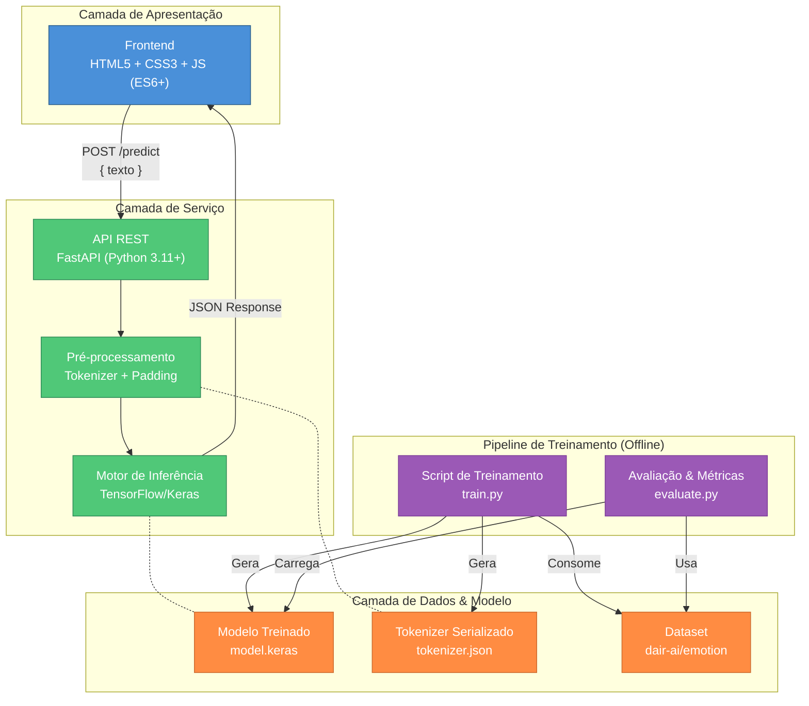
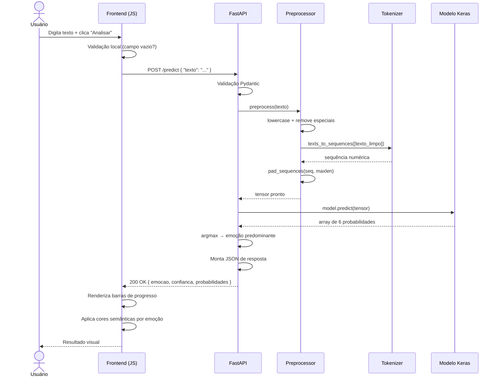
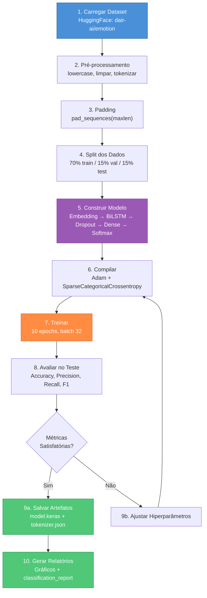

# Plataforma de Reconhecimento de Emoções em Texto — Arquitetura & Plano de Implementação

## 1. Análise Comparativa dos Dois Documentos

Antes de propor a arquitetura final, segue um resumo das convergências e divergências entre os documentos [PROJETO.md](file:///c:/Users/LAB_01/Documents/VSCODE/ia_indetificador_emocao/PROJETO.md) e [projeto2.md](file:///c:/Users/LAB_01/Documents/VSCODE/ia_indetificador_emocao/projeto2.md).

### Convergências (aceitas na proposta final)

| Aspecto | Ambos concordam |
|---|---|
| **Objetivo** | Classificação de emoções em texto via Deep Learning |
| **Dataset** | Emotion Dataset (dair-ai/emotion) — Hugging Face |
| **Classes** | 6 emoções: `sadness`, `joy`, `love`, `anger`, `fear`, `surprise` |
| **Frontend** | HTML5 + CSS3 + JavaScript puro (sem SPA complexo) |
| **Backend** | Python 3.11+ |
| **Modelo** | Embedding → Bidirectional LSTM → Dense → Softmax (6 neurônios) |
| **Hiperparâmetros** | 70/15/15 split, 10 epochs, batch 32, Adam, SparseCategoricalCrossentropy |
| **Métricas** | Accuracy, Precision, Recall, F1-score + Matriz de Confusão opcional |
| **API** | `POST /predict` com entrada `{ "texto": "..." }` e saída com emoção + confiança + probabilidades |

### Divergências e Decisões

| Aspecto | PROJETO.md (Analista 1) | projeto2.md (Analista 2) | **Decisão Final** |
|---|---|---|---|
| **Framework backend** | Recomenda Flask | Prioriza FastAPI | **FastAPI** — tipagem nativa, docs automáticos (Swagger/ReDoc), async nativo, validação via Pydantic |
| **Estrutura de pastas** | `backend/` contém tudo (app, train, model, dataset, tokenizer) | Separa `model/` do `backend/` | **Separar `model/`** — isola o pipeline de ML do servidor web (princípio de responsabilidade única) |
| **Tokenizer** | Pasta `tokenizer/` dentro de `backend/` | `tokenizer.json` dentro de `model/` | **Tokenizer em `model/`** — o tokenizer é artefato do treinamento, não do servidor |
| **Pré-processamento** | NLTK mencionado | Não menciona NLTK | **Keras Tokenizer** é suficiente. NLTK apenas se stemming/lemmatization for necessário após validação |
| **Frontend UX** | Wireframe básico textual | Barras de progresso CSS dinâmicas com cores por emoção | **Adotar barras dinâmicas com cores semânticas** — UX muito superior |
| **Formato modelo salvo** | Genérico (`model/`) | Explícito: `model.keras` | **`model.keras`** — formato nativo do Keras 3+ |
| **Dropout/Regularização** | Não menciona | Menciona Dropout no Dense | **Incluir Dropout (0.3–0.5)** — previne overfitting, essencial em LSTM |
| **Documentação** | Pasta `docs/` separada + README | README como relatório final | **Ambos**: `docs/` para documentação técnica e notebooks, `README.md` como porta de entrada |
| **Campo da resposta** | `"emocao"` | `"emocao_predominante"` | **`"emocao_predominante"`** — mais explícito e autodocumentado |

---

## 2. Arquitetura do Sistema

### Visão Geral (3 Camadas)



### Princípios Arquiteturais

1. **Separação ML ↔ Servidor**: O treinamento é um pipeline offline independente. O backend apenas carrega artefatos já treinados.
2. **Modelo como Artefato**: O `model.keras` e `tokenizer.json` são artefatos versionáveis, gerados pelo pipeline de treinamento e consumidos pelo servidor.
3. **Stateless API**: O backend não mantém estado de sessão. Cada request é independente.
4. **Frontend Desacoplado**: O frontend comunica exclusivamente via REST, podendo ser servido por qualquer servidor estático.

---

## 3. Estrutura de Pastas Definitiva

```text
ia_identificador_emocao/
│
├── model/                          # Pipeline de Machine Learning (offline)
│   ├── train.py                    # Script principal de treinamento
│   ├── evaluate.py                 # Avaliação do modelo: métricas + gráficos
│   ├── preprocess.py               # Funções de pré-processamento reutilizáveis
│   ├── config.py                   # Hiperparâmetros centralizados (epochs, batch, etc.)
│   ├── artifacts/                  # Artefatos gerados (gitignore parcial)
│   │   ├── emotion_model.keras     # Modelo treinado salvo
│   │   └── tokenizer.json          # Vocabulário serializado
│   └── outputs/                    # Gráficos e relatórios gerados
│       ├── training_history.png    # Curvas de loss/accuracy
│       ├── confusion_matrix.png   # Matriz de confusão
│       └── classification_report.txt
│
├── backend/                        # Servidor API
│   ├── main.py                     # Entrypoint FastAPI
│   ├── schemas.py                  # Modelos Pydantic (request/response)
│   ├── predictor.py                # Classe que encapsula inferência
│   └── requirements.txt           # Dependências do backend
│
├── frontend/                       # Interface web
│   ├── index.html                  # Página principal
│   ├── css/
│   │   └── style.css               # Estilos + barras de progresso dinâmicas
│   └── js/
│       └── app.js                  # Fetch API + renderização do DOM
│
├── docs/                           # Documentação do projeto
│   ├── relatorio_tecnico.md        # Relatório acadêmico completo
│   └── api_reference.md            # Documentação da API (complementar ao Swagger)
│
├── requirements.txt                # Dependências globais (treinamento + backend)
├── README.md                       # Visão geral + instruções de execução
└── .gitignore
```

### Justificativa da Estrutura

| Decisão | Motivo |
|---|---|
| `model/` separado de `backend/` | O treinamento é executado uma vez (ou poucas vezes). O backend roda continuamente. São ciclos de vida diferentes. |
| `model/artifacts/` | Centraliza artefatos gerados pelo treinamento em subpasta clara. Facilita versionamento e `.gitignore`. |
| `model/preprocess.py` | O pré-processamento é compartilhado entre treino e inferência. Extraí-lo evita duplicação de lógica. |
| `model/config.py` | Hiperparâmetros centralizados facilitam experimentação e documentação. |
| `backend/schemas.py` | Pydantic models garantem validação automática e documentação dos contratos de API. |
| `backend/predictor.py` | Encapsula o carregamento do modelo e tokenizer + lógica de inferência. `main.py` fica limpo. |
| `frontend/css/` e `frontend/js/` | Separação clássica de responsabilidades no frontend. |

---

## 4. Contratos da API

### 4.1 `POST /predict` — Predição de Emoção

**Descrição**: Recebe um texto e retorna a emoção predominante com distribuição de probabilidades.

#### Request

```http
POST /predict HTTP/1.1
Content-Type: application/json

{
  "texto": "Estou muito feliz hoje"
}
```

#### Validações (Pydantic)

| Campo | Tipo | Obrigatório | Validação |
|---|---|---|---|
| `texto` | `string` | Sim | `min_length=1`, `max_length=5000`, `strip_whitespace=True` |

#### Response — Sucesso (200)

```json
{
  "emocao_predominante": "joy",
  "confianca": 0.92,
  "probabilidades": {
    "sadness": 0.01,
    "joy": 0.92,
    "love": 0.03,
    "anger": 0.01,
    "fear": 0.01,
    "surprise": 0.02
  }
}
```

| Campo | Tipo | Descrição |
|---|---|---|
| `emocao_predominante` | `string` | Label da emoção com maior probabilidade |
| `confianca` | `float` | Valor da maior probabilidade (0.0 a 1.0) |
| `probabilidades` | `object` | Dicionário com as 6 emoções e suas probabilidades (somam ~1.0) |

#### Response — Erro de Validação (422)

```json
{
  "detail": [
    {
      "loc": ["body", "texto"],
      "msg": "field required",
      "type": "value_error.missing"
    }
  ]
}
```

#### Response — Erro Interno (500)

```json
{
  "detail": "Erro ao processar a predição. Verifique se o modelo está carregado."
}
```

---

### 4.2 `GET /health` — Health Check

**Descrição**: Verifica se o servidor está ativo e o modelo está carregado.

#### Response (200)

```json
{
  "status": "healthy",
  "modelo_carregado": true,
  "versao": "1.0.0"
}
```

> [!TIP]
> O endpoint `/health` não estava nos documentos originais, mas é uma boa prática para monitoramento e debugging durante o desenvolvimento.

---

### 4.3 CORS

O backend deve habilitar CORS para permitir requisições do frontend servido localmente:

```python
# Origens permitidas durante desenvolvimento
origins = ["http://localhost:5500", "http://127.0.0.1:5500", "http://localhost:8000"]
```

---

## 5. Fluxo de Dados

### 5.1 Fluxo de Inferência (Runtime)



### 5.2 Fluxo de Treinamento (Offline)



---

## 6. Modelo de Deep Learning — Especificação Detalhada

### 6.1 Arquitetura

```text
┌──────────────────────────────────────────────────┐
│                    INPUT                          │
│        Sequência tokenizada + padded             │
│        Shape: (batch_size, max_seq_length)        │
└──────────────────────┬───────────────────────────┘
                       │
┌──────────────────────▼───────────────────────────┐
│              EMBEDDING LAYER                      │
│  vocab_size = ~20.000 (ajustar pós-tokenização)   │
│  embedding_dim = 128                              │
│  output shape: (batch, max_seq_length, 128)       │
└──────────────────────┬───────────────────────────┘
                       │
┌──────────────────────▼───────────────────────────┐
│          BIDIRECTIONAL LSTM                       │
│  units = 64                                       │
│  return_sequences = False                         │
│  output shape: (batch, 128)  ← 64*2 bidirecional │
└──────────────────────┬───────────────────────────┘
                       │
┌──────────────────────▼───────────────────────────┐
│               DROPOUT                             │
│  rate = 0.4                                       │
│  Regularização para prevenir overfitting          │
└──────────────────────┬───────────────────────────┘
                       │
┌──────────────────────▼───────────────────────────┐
│              DENSE LAYER                          │
│  units = 32                                       │
│  activation = 'relu'                              │
│  output shape: (batch, 32)                        │
└──────────────────────┬───────────────────────────┘
                       │
┌──────────────────────▼───────────────────────────┐
│              DROPOUT                              │
│  rate = 0.3                                       │
└──────────────────────┬───────────────────────────┘
                       │
┌──────────────────────▼───────────────────────────┐
│           OUTPUT (SOFTMAX)                        │
│  units = 6 (uma por emoção)                       │
│  activation = 'softmax'                           │
│  output shape: (batch, 6)                         │
│  Σ probabilidades = 1.0                           │
└──────────────────────────────────────────────────┘
```

### 6.2 Hiperparâmetros Consolidados

| Parâmetro | Valor | Justificativa |
|---|---|---|
| `vocab_size` | ~20.000 (definido pelo Tokenizer) | Cobrir vocabulário do dataset sem explosão de memória |
| `max_seq_length` | 128 tokens | Maioria dos textos do dataset tem <100 tokens |
| `embedding_dim` | 128 | Bom equilíbrio dimensionalidade × capacidade |
| `lstm_units` | 64 | Suficiente para capturar padrões em textos curtos |
| `dropout_rate` | 0.4 (pós-LSTM), 0.3 (pós-Dense) | Prevenir overfitting sem subdimensionar |
| `dense_units` | 32 | Camada de transição antes da saída |
| `optimizer` | Adam (lr=0.001 default) | Convergência rápida e estável |
| `loss` | SparseCategoricalCrossentropy | Labels são inteiros (0–5), não one-hot |
| `epochs` | 10 (com EarlyStopping) | Suficiente com EarlyStopping monitorando val_loss |
| `batch_size` | 32 | Padrão consolidado para datasets deste tamanho |

### 6.3 Callbacks Recomendados

| Callback | Configuração | Motivo |
|---|---|---|
| `EarlyStopping` | `monitor='val_loss', patience=3, restore_best_weights=True` | Previne overfitting e garante o melhor modelo |
| `ModelCheckpoint` | `filepath='artifacts/emotion_model.keras', save_best_only=True` | Salva apenas o melhor modelo durante treino |

### 6.4 Pré-processamento — Pipeline Detalhado

```text
Texto Original
    │
    ▼
"I feel VERY happy today!!! :)"
    │
    ├─ 1. lowercase()          → "i feel very happy today!!! :)"
    ├─ 2. regex [^a-z\s]       → "i feel very happy today   "
    ├─ 3. strip + normalize ws → "i feel very happy today"
    ├─ 4. tokenizer.texts_to_sequences() → [5, 42, 87, 12, 9]
    └─ 5. pad_sequences(maxlen=128)      → [0, 0, ..., 5, 42, 87, 12, 9]
```

> [!IMPORTANT]
> O **mesmo pipeline de pré-processamento** deve ser usado no treinamento e na inferência. Por isso `preprocess.py` é um módulo compartilhado.

---

## 7. Frontend — Diretrizes de Design

### 7.1 Paleta de Cores por Emoção

| Emoção | Cor | Hex | Uso |
|---|---|---|---|
| Joy | Amarelo dourado | `#FFD700` | Barra de progresso + destaque |
| Love | Rosa quente | `#FF69B4` | Barra de progresso |
| Surprise | Laranja vibrante | `#FF8C42` | Barra de progresso |
| Fear | Roxo escuro | `#8B5CF6` | Barra de progresso |
| Anger | Vermelho intenso | `#EF4444` | Barra de progresso |
| Sadness | Azul profundo | `#3B82F6` | Barra de progresso |

### 7.2 Componentes da Interface

1. **Header**: Título do projeto com ícone/emoji contextual
2. **Textarea estilizada**: Campo de entrada amplo com placeholder descritivo
3. **Botão "Analisar Emoção"**: Com loading spinner durante requisição
4. **Card de resultado**: Exibindo a emoção predominante em destaque
5. **Barras de progresso**: Uma por emoção, com largura proporcional à probabilidade e cor semântica
6. **Feedback visual**: Animações suaves de entrada para os resultados (CSS transitions)

---

## 8. Plano de Implementação (Fases)

### Fase 1 — Fundação do Pipeline de ML ⏱️ ~3h

| # | Tarefa | Arquivo |
|---|---|---|
| 1.1 | Criar `config.py` com todos os hiperparâmetros | `model/config.py` |
| 1.2 | Implementar `preprocess.py` (limpeza, tokenização, padding) | `model/preprocess.py` |
| 1.3 | Implementar `train.py` (download dataset, treino, salvar artefatos) | `model/train.py` |
| 1.4 | Implementar `evaluate.py` (métricas, matriz de confusão, gráficos) | `model/evaluate.py` |
| 1.5 | Executar treinamento e validar métricas | Terminal |

**Critério de sucesso**: Modelo treinado com Accuracy ≥ 85% e artefatos salvos em `model/artifacts/`.

---

### Fase 2 — Backend API ⏱️ ~2h

| # | Tarefa | Arquivo |
|---|---|---|
| 2.1 | Criar `schemas.py` com modelos Pydantic (PredictRequest, PredictResponse, HealthResponse) | `backend/schemas.py` |
| 2.2 | Criar `predictor.py` encapsulando carregamento do modelo e inferência | `backend/predictor.py` |
| 2.3 | Criar `main.py` com endpoints `/predict` e `/health`, CORS, e carregamento na inicialização | `backend/main.py` |
| 2.4 | Criar `requirements.txt` | `backend/requirements.txt` |
| 2.5 | Testar API via Swagger UI (auto-gerado pelo FastAPI) | Browser |

**Critério de sucesso**: `POST /predict` retorna JSON correto; `GET /health` confirma modelo carregado.

---

### Fase 3 — Frontend ⏱️ ~2h

| # | Tarefa | Arquivo |
|---|---|---|
| 3.1 | Criar `index.html` com estrutura semântica (header, main, resultado) | `frontend/index.html` |
| 3.2 | Criar `style.css` com barras de progresso dinâmicas, paleta de cores, responsividade | `frontend/css/style.css` |
| 3.3 | Criar `app.js` com Fetch API, validação local, renderização dinâmica de resultados | `frontend/js/app.js` |
| 3.4 | Testar integração frontend → backend | Browser |

**Critério de sucesso**: Fluxo completo funciona: digitar texto → clicar → ver resultado com barras coloridas.

---

### Fase 4 — Polimento & Documentação ⏱️ ~1.5h

| # | Tarefa | Arquivo |
|---|---|---|
| 4.1 | Refinar UX: animações, loading states, tratamento de erros | `frontend/*` |
| 4.2 | Escrever `README.md` com instruções de instalação e execução | `README.md` |
| 4.3 | Escrever `relatorio_tecnico.md` com todas as seções exigidas | `docs/relatorio_tecnico.md` |
| 4.4 | Gerar documentação da API | `docs/api_reference.md` |
| 4.5 | Configurar `.gitignore` | `.gitignore` |

**Critério de sucesso**: Projeto reprodutível por terceiros seguindo apenas o README.

---

## 9. Plano de Verificação

### Testes Automatizados

```bash
# 1. Treinar o modelo
cd model && python train.py

# 2. Avaliar métricas
python evaluate.py

# 3. Iniciar o backend
cd ../backend && uvicorn main:app --reload

# 4. Testar endpoint via curl
curl -X POST http://localhost:8000/predict \
  -H "Content-Type: application/json" \
  -d '{"texto": "I am so happy today"}'

# 5. Health check
curl http://localhost:8000/health
```

### Verificação Manual

1. **Modelo**: Verificar que Accuracy ≥ 85%, F1-score balanceado entre classes
2. **API**: Testar via Swagger UI (`http://localhost:8000/docs`)
3. **Frontend**: Testar fluxo completo no browser com textos em inglês variados
4. **Edge cases**: Texto vazio, texto muito longo, caracteres especiais, texto sem emoção clara

---

## User Review Required

> [!IMPORTANT]
> **Framework Backend**: Estou propondo **FastAPI** em vez de Flask. FastAPI oferece validação automática, documentação Swagger integrada e é mais moderno. Confirma essa escolha?

> [!IMPORTANT]
> **Idioma do texto de entrada**: O dataset `dair-ai/emotion` é **em inglês**. O modelo será treinado com textos em inglês. Se o objetivo é aceitar textos **em português**, será necessário um dataset diferente ou tradução automática. **Qual idioma de entrada é esperado?**

> [!WARNING]
> **Dataset local vs. download**: O `train.py` pode baixar o dataset direto do Hugging Face via `datasets` library. Isso requer internet durante o treinamento. Alternativamente, posso incluir um CSV local. **Qual abordagem preferem?**

## Open Questions

1. **Existe alguma preferência de porta** para o backend (ex: 8000) e para o frontend (ex: 5500)?
2. **O relatório técnico** deve seguir algum template específico da disciplina (ABNT, IEEE, etc.)?
3. **GPU disponível?** O treinamento com BiLSTM é leve o suficiente para CPU, mas se houver GPU, podemos otimizar.
4. **O arquivo `barber.png`** existente no projeto tem alguma relação com o projeto de emoções ou pode ser ignorado?
