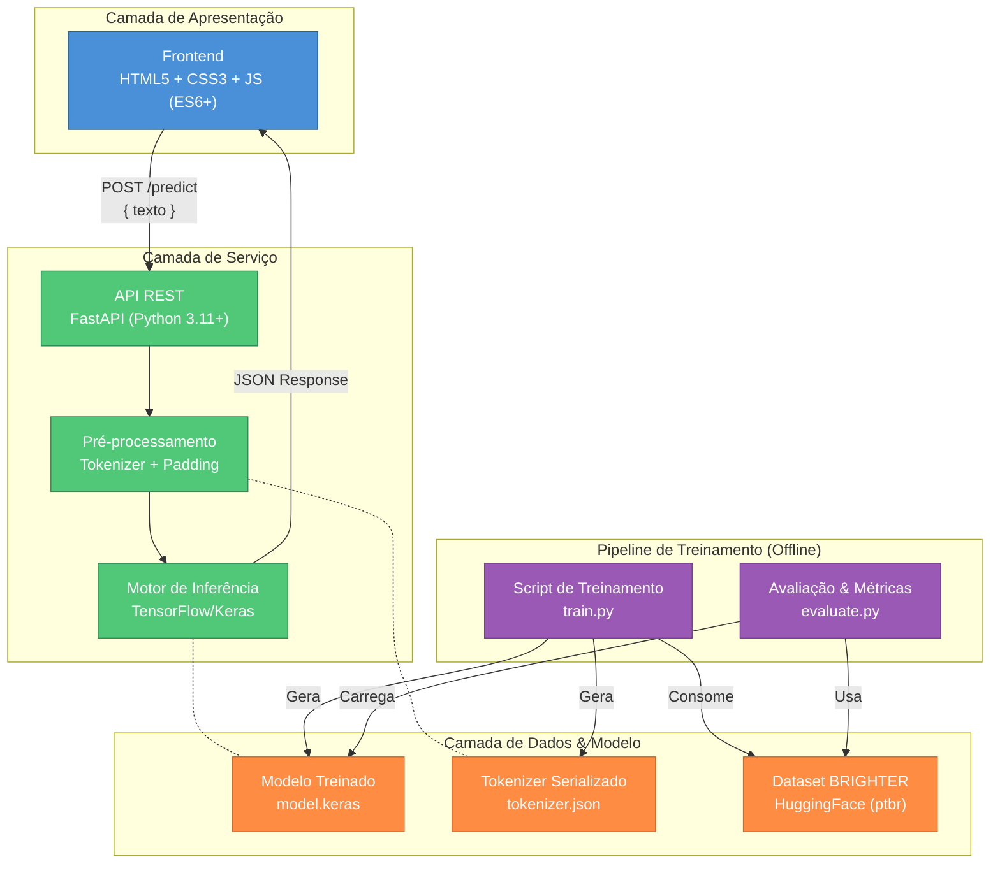
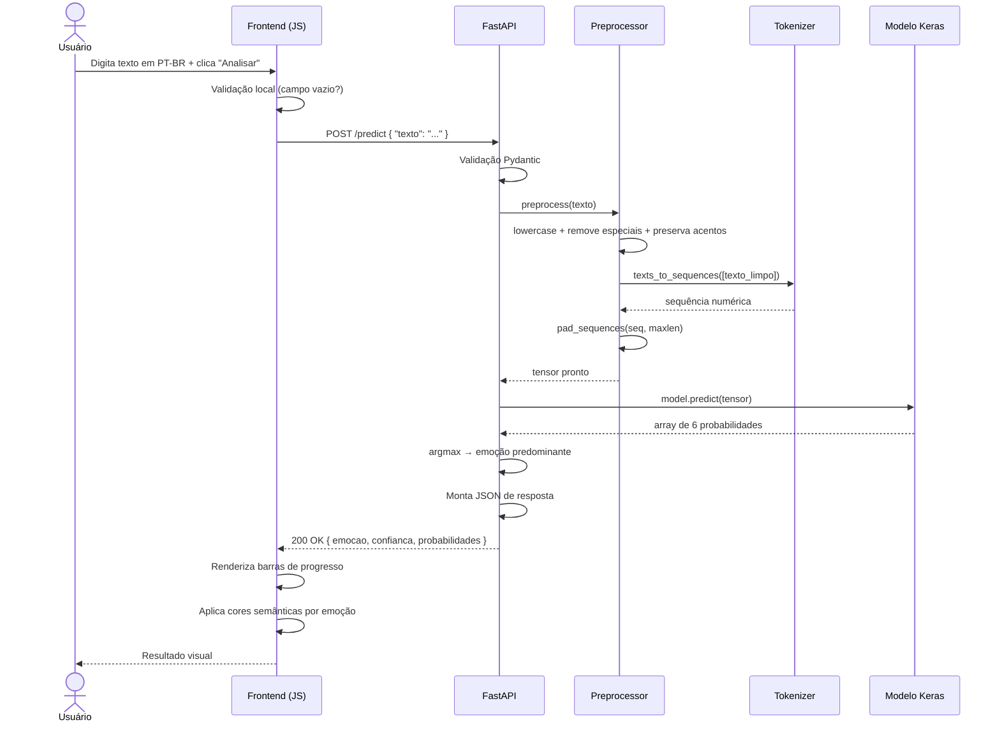
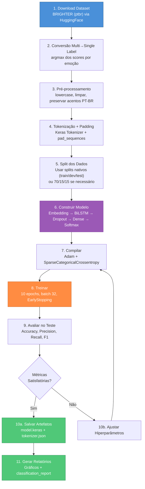

# Plataforma de Reconhecimento de Emoções em Texto (PT-BR) — Arquitetura & Plano de Implementação

## 1. Análise Comparativa dos Dois Documentos

Resumo das convergências e divergências entre [PROJETO.md](file:///c:/Users/LAB_01/Documents/VSCODE/ia_indetificador_emocao/PROJETO.md) e [projeto2.md](file:///c:/Users/LAB_01/Documents/VSCODE/ia_indetificador_emocao/projeto2.md).

### Convergências (aceitas na proposta final)

| Aspecto | Ambos concordam |
|---|---|
| **Objetivo** | Classificação de emoções em texto via Deep Learning |
| **Classes** | 6 emoções categóricas |
| **Frontend** | HTML5 + CSS3 + JavaScript puro (sem SPA complexo) |
| **Backend** | Python 3.11+ |
| **Modelo** | Embedding → Bidirectional LSTM → Dense → Softmax (6 neurônios) |
| **Hiperparâmetros** | 70/15/15 split, 10 epochs, batch 32, Adam, SparseCategoricalCrossentropy |
| **Métricas** | Accuracy, Precision, Recall, F1-score + Matriz de Confusão opcional |
| **API** | `POST /predict` com entrada `{ "texto": "..." }` e saída com emoção + confiança + probabilidades |

### Divergências e Decisões

| Aspecto | PROJETO.md (Analista 1) | projeto2.md (Analista 2) | **Decisão Final** |
|---|---|---|---|
| **Framework backend** | Recomenda Flask | Prioriza FastAPI | **FastAPI** — mais fácil: validação automática via Pydantic, Swagger gratuito, menos boilerplate |
| **Dataset** | `dair-ai/emotion` (inglês) | `dair-ai/emotion` (inglês) | **BRIGHTER** (`brighter-dataset/BRIGHTER-emotion-categories`, config `ptbr`) — dataset **nativo em PT-BR** com 6 emoções |
| **Estrutura de pastas** | `backend/` contém tudo | Separa `model/` do `backend/` | **Separar `model/`** — isola pipeline ML do servidor web |
| **Tokenizer** | Pasta `tokenizer/` em `backend/` | `tokenizer.json` em `model/` | **Tokenizer em `model/`** — artefato do treinamento |
| **Frontend UX** | Wireframe básico textual | Barras de progresso CSS com cores por emoção | **Barras dinâmicas com cores semânticas** |
| **Formato modelo** | Genérico (`model/`) | Explícito: `model.keras` | **`model.keras`** — formato nativo Keras 3+ |
| **Dropout** | Não menciona | Menciona Dropout no Dense | **Incluir Dropout (0.3–0.5)** — previne overfitting |
| **Campo da resposta** | `"emocao"` | `"emocao_predominante"` | **`"emocao_predominante"`** — mais explícito |

---

## 2. Decisão do Dataset — BRIGHTER (PT-BR)

> [!IMPORTANT]
> O dataset original (`dair-ai/emotion`) é em **inglês**. Como o requisito é suporte a **português brasileiro**, estou propondo o **BRIGHTER**.

### Dataset Escolhido: BRIGHTER — Emotion Categories

| Atributo | Detalhe |
|---|---|
| **Nome** | `brighter-dataset/BRIGHTER-emotion-categories` |
| **Config** | `ptbr` (Português Brasileiro) |
| **Fonte** | [HuggingFace](https://huggingface.co/datasets/brighter-dataset/BRIGHTER-emotion-categories) |
| **Idioma** | 🇧🇷 Português Brasileiro **nativo** (não traduzido) |
| **Anotação** | Humana (crowdsourced) |
| **Classes (6)** | `anger`, `disgust`, `fear`, `joy`, `sadness`, `surprise` |
| **Splits** | `train`, `dev`, `test` (pré-definidos) |
| **Formato labels** | Multi-label com scores por emoção (convertíveis para single-label via argmax) |
| **Licença** | Público e acadêmico |

### Diferenças em relação ao `dair-ai/emotion`

| Aspecto | `dair-ai/emotion` | **BRIGHTER (ptbr)** |
|---|---|---|
| Idioma | Inglês | 🇧🇷 Português Brasileiro |
| Classes | sadness, joy, love, anger, fear, surprise | anger, disgust, fear, joy, sadness, surprise |
| Mudança | tem `love` | tem `disgust` (nojo) no lugar de `love` |
| Labels | Single-label (inteiro) | Multi-label com scores → converter para single-label |
| Origem | Tweets em inglês | Textos em PT-BR anotados por humanos |

> [!WARNING]
> As classes mudam ligeiramente: **`love` sai e `disgust` entra**. Isso segue a taxonomia de Ekman (6 emoções básicas universais), que é mais fundamentada cientificamente. A interface e API serão adaptadas para as 6 classes do BRIGHTER.

### Carregamento do Dataset

```python
from datasets import load_dataset

# Download direto do HuggingFace (config ptbr)
dataset = load_dataset("brighter-dataset/BRIGHTER-emotion-categories", "ptbr")
# Splits: dataset["train"], dataset["dev"], dataset["test"]
```

### Conversão para Single-Label

Como o BRIGHTER usa scores por emoção, faremos:
```python
# Para cada amostra, a emoção predominante é a com maior score
# Exemplo: {"anger": 0, "disgust": 0, "fear": 0, "joy": 3, "sadness": 0, "surprise": 1}
# → label = "joy" (índice 3)
label = argmax([anger, disgust, fear, joy, sadness, surprise])
```

---

## 3. Arquitetura do Sistema

### Visão Geral (3 Camadas)



### Princípios Arquiteturais

1. **Separação ML ↔ Servidor**: O treinamento é um pipeline offline independente. O backend apenas carrega artefatos já treinados.
2. **Modelo como Artefato**: `model.keras` e `tokenizer.json` são artefatos versionáveis.
3. **Stateless API**: Cada request é independente, sem estado de sessão.
4. **Frontend Desacoplado**: Comunica exclusivamente via REST.

---

## 4. Estrutura de Pastas Definitiva

```text
ia_identificador_emocao/
│
├── model/                          # Pipeline de Machine Learning (offline)
│   ├── train.py                    # Script principal de treinamento
│   ├── evaluate.py                 # Avaliação: métricas + gráficos
│   ├── preprocess.py               # Funções de pré-processamento (compartilhado)
│   ├── config.py                   # Hiperparâmetros centralizados
│   ├── artifacts/                  # Artefatos gerados
│   │   ├── emotion_model.keras     # Modelo treinado salvo
│   │   └── tokenizer.json          # Vocabulário serializado
│   └── outputs/                    # Gráficos e relatórios gerados
│       ├── training_history.png    # Curvas de loss/accuracy
│       ├── confusion_matrix.png    # Matriz de confusão
│       └── classification_report.txt
│
├── backend/                        # Servidor API
│   ├── main.py                     # Entrypoint FastAPI
│   ├── schemas.py                  # Modelos Pydantic (request/response)
│   ├── predictor.py                # Classe que encapsula inferência
│   └── requirements.txt           # Dependências do backend
│
├── frontend/                       # Interface web
│   ├── index.html                  # Página principal
│   ├── css/
│   │   └── style.css               # Estilos + barras dinâmicas
│   └── js/
│       └── app.js                  # Fetch API + renderização DOM
│
├── docs/                           # Documentação
│   ├── relatorio_tecnico.md        # Relatório acadêmico completo
│   └── api_reference.md            # Documentação complementar da API
│
├── requirements.txt                # Dependências globais (treino + backend)
├── README.md                       # Visão geral + instruções de execução
└── .gitignore
```

### Justificativa

| Decisão | Motivo |
|---|---|
| `model/` separado de `backend/` | Ciclos de vida diferentes: treino (offline, raro) vs servidor (contínuo) |
| `model/artifacts/` | Centraliza artefatos em subpasta clara para versionamento e `.gitignore` |
| `model/preprocess.py` | Pré-processamento compartilhado entre treino e inferência — evita duplicação |
| `model/config.py` | Hiperparâmetros centralizados facilitam experimentação |
| `backend/schemas.py` | Pydantic garante validação automática e documenta contratos |
| `backend/predictor.py` | Encapsula carregamento + inferência. `main.py` fica limpo |

---

## 5. Contratos da API

### 5.1 `POST /predict` — Predição de Emoção

**Descrição**: Recebe um texto em português e retorna a emoção predominante.

#### Request

```http
POST /predict HTTP/1.1
Content-Type: application/json

{
  "texto": "Estou muito feliz hoje com essa conquista!"
}
```

#### Validações (Pydantic)

| Campo | Tipo | Obrigatório | Validação |
|---|---|---|---|
| `texto` | `string` | Sim | `min_length=1`, `max_length=5000`, `strip_whitespace=True` |

#### Response — Sucesso (200)

```json
{
  "emocao_predominante": "joy",
  "confianca": 0.89,
  "probabilidades": {
    "anger": 0.02,
    "disgust": 0.01,
    "fear": 0.01,
    "joy": 0.89,
    "sadness": 0.03,
    "surprise": 0.04
  }
}
```

| Campo | Tipo | Descrição |
|---|---|---|
| `emocao_predominante` | `string` | Label da emoção com maior probabilidade |
| `confianca` | `float` | Valor da maior probabilidade (0.0 a 1.0) |
| `probabilidades` | `object` | Dicionário com as 6 emoções e suas probabilidades (somam ~1.0) |

#### Response — Erro de Validação (422)

```json
{
  "detail": [
    {
      "loc": ["body", "texto"],
      "msg": "field required",
      "type": "value_error.missing"
    }
  ]
}
```

#### Response — Erro Interno (500)

```json
{
  "detail": "Erro ao processar a predição. Verifique se o modelo está carregado."
}
```

---

### 5.2 `GET /health` — Health Check

```json
{
  "status": "healthy",
  "modelo_carregado": true,
  "versao": "1.0.0"
}
```

> [!TIP]
> Endpoint extra não previsto nos documentos originais. Útil para debug e monitoramento.

---

### 5.3 CORS

```python
origins = ["http://localhost:5500", "http://127.0.0.1:5500", "http://localhost:8000"]
```

---

## 6. Fluxo de Dados

### 6.1 Fluxo de Inferência (Runtime)



### 6.2 Fluxo de Treinamento (Offline)



---

## 7. Modelo de Deep Learning — Especificação Detalhada

### 7.1 Arquitetura

```text
┌──────────────────────────────────────────────────┐
│                    INPUT                          │
│        Sequência tokenizada + padded             │
│        Shape: (batch_size, max_seq_length)        │
└──────────────────────┬───────────────────────────┘
                       │
┌──────────────────────▼───────────────────────────┐
│              EMBEDDING LAYER                      │
│  vocab_size = ~20.000 (ajustar pós-tokenização)   │
│  embedding_dim = 128                              │
│  output shape: (batch, max_seq_length, 128)       │
└──────────────────────┬───────────────────────────┘
                       │
┌──────────────────────▼───────────────────────────┐
│          BIDIRECTIONAL LSTM                       │
│  units = 64                                       │
│  return_sequences = False                         │
│  output shape: (batch, 128)  ← 64×2 bidirecional │
└──────────────────────┬───────────────────────────┘
                       │
┌──────────────────────▼───────────────────────────┐
│               DROPOUT                             │
│  rate = 0.4                                       │
│  Regularização para prevenir overfitting          │
└──────────────────────┬───────────────────────────┘
                       │
┌──────────────────────▼───────────────────────────┐
│              DENSE LAYER                          │
│  units = 32                                       │
│  activation = 'relu'                              │
│  output shape: (batch, 32)                        │
└──────────────────────┬───────────────────────────┘
                       │
┌──────────────────────▼───────────────────────────┐
│              DROPOUT                              │
│  rate = 0.3                                       │
└──────────────────────┬───────────────────────────┘
                       │
┌──────────────────────▼───────────────────────────┐
│           OUTPUT (SOFTMAX)                        │
│  units = 6 (uma por emoção)                       │
│  activation = 'softmax'                           │
│  output shape: (batch, 6)                         │
│  Σ probabilidades = 1.0                           │
└──────────────────────────────────────────────────┘
```

### 7.2 Hiperparâmetros Consolidados

| Parâmetro | Valor | Justificativa |
|---|---|---|
| `vocab_size` | ~20.000 (definido pelo Tokenizer) | Cobrir vocabulário PT-BR do dataset |
| `max_seq_length` | 128 tokens | Cobrir maioria dos textos sem desperdício |
| `embedding_dim` | 128 | Bom equilíbrio dimensionalidade × capacidade |
| `lstm_units` | 64 | Suficiente para capturar padrões em textos curtos |
| `dropout_rate` | 0.4 (pós-LSTM), 0.3 (pós-Dense) | Prevenir overfitting |
| `dense_units` | 32 | Camada de transição |
| `optimizer` | Adam (lr=0.001) | Convergência rápida e estável |
| `loss` | SparseCategoricalCrossentropy | Labels convertidas para inteiros (0–5) |
| `epochs` | 10 (com EarlyStopping) | Suficiente com early stopping |
| `batch_size` | 32 | Padrão consolidado |

### 7.3 Callbacks

| Callback | Configuração | Motivo |
|---|---|---|
| `EarlyStopping` | `monitor='val_loss', patience=3, restore_best_weights=True` | Previne overfitting |
| `ModelCheckpoint` | `save_best_only=True` | Salva apenas o melhor modelo |

### 7.4 Pré-processamento — Pipeline para PT-BR

```text
Texto Original
    │
    ▼
"Estou MUITO feliz hoje!!! 😊"
    │
    ├─ 1. lowercase()              → "estou muito feliz hoje!!! 😊"
    ├─ 2. regex [^a-záàâãéêíóôõúüç\s]  → "estou muito feliz hoje   "
    │        (PRESERVA acentos e ç do português!)
    ├─ 3. strip + normalize ws    → "estou muito feliz hoje"
    ├─ 4. tokenizer.texts_to_sequences() → [12, 45, 89, 7]
    └─ 5. pad_sequences(maxlen=128)      → [0, 0, ..., 12, 45, 89, 7]
```

> [!IMPORTANT]
> **Diferença crucial para PT-BR**: O regex de limpeza **preserva caracteres acentuados** (`á, â, ã, é, ê, í, ó, ô, õ, ú, ü, ç`). O regex do projeto original (`[^a-z\s]`) removeria todos os acentos, destruindo informação semântica do português.

---

## 8. Frontend — Diretrizes de Design

### 8.1 Paleta de Cores por Emoção (6 classes BRIGHTER)

| Emoção | Label PT-BR | Cor | Hex | Emoji |
|---|---|---|---|---|
| Joy | Alegria | Amarelo dourado | `#FFD700` | 😄 |
| Sadness | Tristeza | Azul profundo | `#3B82F6` | 😢 |
| Anger | Raiva | Vermelho intenso | `#EF4444` | 😡 |
| Fear | Medo | Roxo escuro | `#8B5CF6` | 😨 |
| Surprise | Surpresa | Laranja vibrante | `#FF8C42` | 😲 |
| Disgust | Nojo | Verde escuro | `#059669` | 🤢 |

### 8.2 Componentes da Interface

1. **Header**: Título do projeto com ícone/emoji contextual
2. **Textarea estilizada**: Campo de entrada amplo com placeholder em PT-BR
3. **Botão "Analisar Emoção"**: Com loading spinner durante requisição
4. **Card de resultado**: Emoção predominante em destaque com emoji
5. **Barras de progresso**: Uma por emoção, largura proporcional, cor semântica
6. **Labels em PT-BR**: Exibir nomes das emoções em português na interface
7. **Animações**: CSS transitions suaves para entrada dos resultados

---

## 9. Plano de Implementação (Fases)

### Fase 1 — Pipeline de ML ⏱️ ~3h

| # | Tarefa | Arquivo |
|---|---|---|
| 1.1 | Criar `config.py` com hiperparâmetros e mapa de emoções PT-BR | `model/config.py` |
| 1.2 | Implementar `preprocess.py` (limpeza PT-BR, tokenização, padding) | `model/preprocess.py` |
| 1.3 | Implementar `train.py` (download BRIGHTER, conversão multi→single label, treino) | `model/train.py` |
| 1.4 | Implementar `evaluate.py` (métricas, matriz de confusão, gráficos) | `model/evaluate.py` |
| 1.5 | Executar treinamento e validar métricas | Terminal |

**Critério de sucesso**: Modelo treinado com métricas razoáveis e artefatos salvos em `model/artifacts/`.

---

### Fase 2 — Backend API ⏱️ ~2h

| # | Tarefa | Arquivo |
|---|---|---|
| 2.1 | Criar `schemas.py` com modelos Pydantic | `backend/schemas.py` |
| 2.2 | Criar `predictor.py` encapsulando carregamento e inferência | `backend/predictor.py` |
| 2.3 | Criar `main.py` com endpoints `/predict` e `/health`, CORS | `backend/main.py` |
| 2.4 | Criar `requirements.txt` | `backend/requirements.txt` |
| 2.5 | Testar API via Swagger UI | Browser |

**Critério de sucesso**: `POST /predict` retorna JSON correto com texto em PT-BR.

---

### Fase 3 — Frontend ⏱️ ~2h

| # | Tarefa | Arquivo |
|---|---|---|
| 3.1 | Criar `index.html` com estrutura semântica | `frontend/index.html` |
| 3.2 | Criar `style.css` com barras de progresso, paleta, responsividade, dark mode | `frontend/css/style.css` |
| 3.3 | Criar `app.js` com Fetch API, validação, renderização dinâmica | `frontend/js/app.js` |
| 3.4 | Testar integração frontend → backend | Browser |

**Critério de sucesso**: Fluxo completo funciona com texto em PT-BR → resultado com barras coloridas.

---

### Fase 4 — Polimento & Documentação ⏱️ ~1.5h

| # | Tarefa | Arquivo |
|---|---|---|
| 4.1 | Refinar UX: animações, loading, tratamento de erros | `frontend/*` |
| 4.2 | Escrever `README.md` com instruções | `README.md` |
| 4.3 | Escrever `relatorio_tecnico.md` | `docs/relatorio_tecnico.md` |
| 4.4 | Documentação da API | `docs/api_reference.md` |
| 4.5 | `.gitignore` | `.gitignore` |
| 4.6 | `requirements.txt` global | `requirements.txt` |

**Critério de sucesso**: Projeto reprodutível por terceiros seguindo o README.

---

## 10. Plano de Verificação

### Testes via Terminal

```bash
# 1. Instalar dependências
pip install -r requirements.txt

# 2. Treinar o modelo
cd model && python train.py

# 3. Avaliar métricas
python evaluate.py

# 4. Iniciar o backend
cd ../backend && uvicorn main:app --reload --port 8000

# 5. Testar endpoint
curl -X POST http://localhost:8000/predict ^
  -H "Content-Type: application/json" ^
  -d "{\"texto\": \"Estou muito feliz hoje\"}"

# 6. Health check
curl http://localhost:8000/health
```

### Verificação Manual

1. **Modelo**: Verificar métricas no `classification_report.txt`
2. **API**: Testar via Swagger UI (`http://localhost:8000/docs`)
3. **Frontend**: Testar fluxo completo no browser com textos variados em PT-BR
4. **Edge cases**: Texto vazio, texto muito longo, emojis, caracteres especiais, texto ambíguo

---

## Dependências Principais

```text
# Machine Learning
tensorflow>=2.15
datasets           # HuggingFace datasets (download BRIGHTER)
pandas
numpy
scikit-learn
matplotlib
seaborn

# Backend
fastapi
uvicorn[standard]
pydantic
python-multipart

# Opcional
nltk               # Apenas se stemming for necessário
```

---

## Resumo das Decisões Finais

| Questão | Decisão |
|---|---|
| Framework | **FastAPI** (mais fácil, validação automática) |
| Idioma | **Português Brasileiro** |
| Dataset | **BRIGHTER** (`brighter-dataset/BRIGHTER-emotion-categories`, config `ptbr`) |
| Download | **Via HuggingFace `datasets` library** (direto, sem CSV) |
| Classes | `anger`, `disgust`, `fear`, `joy`, `sadness`, `surprise` |
| `barber.png` | **Ignorado** — será adicionado manualmente pelo usuário |
